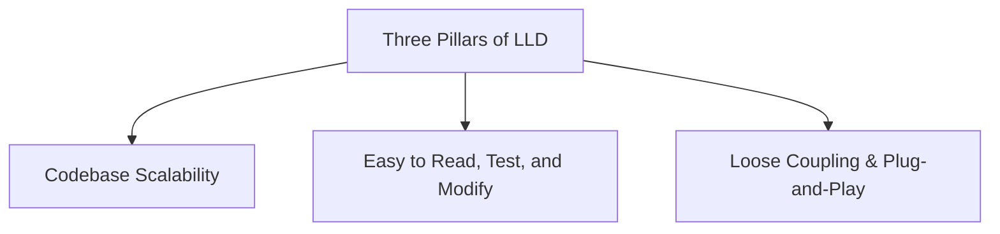
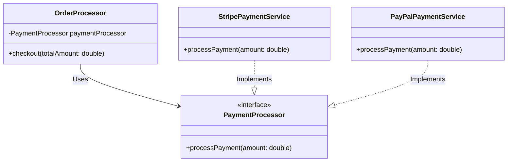
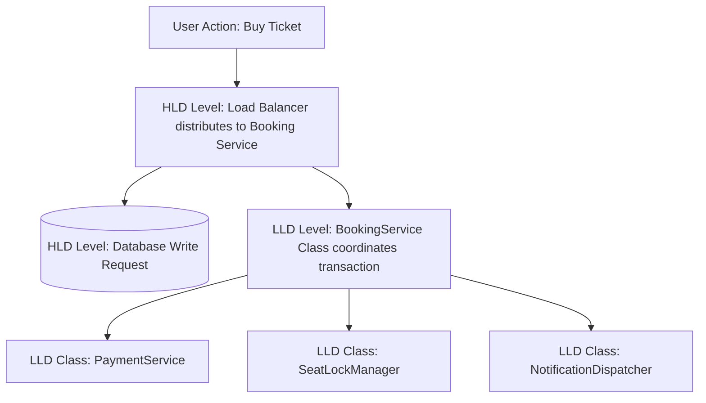

# Introduction to System Design

## 1. What is Low-Level Design (LLD)?

Low-Level Design (LLD), also known as Object-Oriented Design (OOD) or Component-Level Design, is the phase in software engineering where high-level system architecture is translated into a detailed blueprint for actual code implementation. It defines the internal structure of components, classes, interfaces, methods, database tables, and the relationships between them.

While High-Level Design (HLD) describes *what* the system does and how servers interact, Low-Level Design describes *how* the code inside those servers is organized and written.

### Key Components of LLD
- **Class Diagrams:** Visual representations of classes, their attributes, methods, and relationships (inheritance, association, composition, aggregation).
- **Sequence Diagrams:** Diagrams illustrating how objects interact and communicate with each other over time to perform a specific task.
- **Design Patterns:** Reusable solutions to commonly occurring software design problems (e.g., Singleton, Factory, Strategy, Observer).
- **Database Schema Design:** Detailed table structures, primary/foreign keys, normalization, and entity-relationship diagrams (ERDs).
- **Object-Oriented Programming (OOP) Principles:** Core concepts such as Abstraction, Encapsulation, Inheritance, and Polymorphism, combined with the SOLID design principles.

### Real-Life Analogy: Building a House
Imagine you are building a modern skyscraper:
- **High-Level Design (HLD):** This is the architectural layout. It shows how many floors the building has, where the main entry and exit gates are located, how water and electricity enter the building, and where the elevator shafts are placed.
- **Low-Level Design (LLD):** This is the detail-oriented engineering blueprint for a single floor or apartment. It specifies the exact thickness of the electrical wires, the layout of plumbing pipes inside the bathroom walls, the type of screws to use for the cabinets, and the exact specifications of the door locks. 

---

## 2. LLD vs. DSA (Data Structures & Algorithms)

A common point of confusion for beginners is distinguishing between Low-Level Design and Data Structures & Algorithms. Both are crucial for software development, but they solve entirely different problems.

| Parameter | Data Structures & Algorithms (DSA) | Low-Level Design (LLD) |
| :--- | :--- | :--- |
| **Primary Focus** | Computational efficiency (Speed and Memory). | Structural quality (Readability, Maintainability, Extensibility). |
| **Core Goal** | Solve a specific mathematical or algorithmic problem in the shortest time ($O(N \log N)$ time) and minimal space ($O(1)$ auxiliary space). | Structure code so that it is easy to understand, test, modify, and scale as business requirements change over time. |
| **Evaluation Metric** | Time Complexity ($O$) and Space Complexity ($S$). | Adherence to SOLID principles, design patterns, clean code practices, and low coupling. |
| **Key Question** | "How can I sort this list of one million users as fast as possible?" | "How can I design my payment module so that adding a new payment gateway takes less than an hour and does not break existing code?" |
| **Scope of Impact** | Localized to a single method, function, or algorithm. | Global across the module, component, or system codebase. |

### How They Work Together (Synergy)
DSA and LLD are not competitors; they complement each other. LLD provides the skeleton (how classes and interfaces interact), and DSA provides the muscle (how the actual logic inside a class method performs a calculation).

**Example Scenario: Navigation App**
- **LLD Role:** You design a `RoutePlanner` class that communicates with a `MapRenderer` class and takes a `RoutingStrategy` interface. You structure these components so you can swap out driving routes for walking routes easily.
- **DSA Role:** Inside the `DrivingRouteCalculator` class (which implements `RoutingStrategy`), you write the actual Dijkstra or A* search algorithm using priority queues to find the mathematically shortest path.

---

## 3. The Three Pillars of LLD

The ultimate goal of LLD is to build software that can withstand change. To achieve this, LLD rests on three core pillars: Scalability, Maintainability, and Reusability.



### Pillar 1: Scalability (From a Codebase Perspective)
In HLD, scalability means handling more user requests by adding more servers (horizontal scaling) or upgrading hardware (vertical scaling). 
In LLD, **scalability refers to codebase and team scalability**. It answers:
- Can 50 developers work on this codebase simultaneously without constantly overwriting each other's code?
- Can we add 10 new features next month without the codebase collapsing under its own complexity?
If your code is modular and properly encapsulated, different teams can work on different components independently, allowing the organization to scale its engineering capacity.

### Pillar 2: Maintainability
Software spends most of its life in the maintenance phase. A maintainable codebase is one where:
- **It is easy to read:** A new developer can read the class names and understand what the system does without needing a guide.
- **It is easy to debug:** When a bug occurs, the stack trace points directly to a single, well-defined class rather than a giant 5,000-line file.
- **It is easy to test:** Classes are small and isolated, making it easy to write unit tests with mocked dependencies.

### Pillar 3: Reusability (Loose Coupling & Plug-and-Play)
Reusability means writing a component once and using it in multiple places without modifications. The secret to reusability is avoiding **tight coupling** and embracing **loose coupling**.

- **Tight Coupling:** Two classes are highly dependent on each other. If Class A changes, Class B must be modified. This makes the system fragile.
- **Loose Coupling (Plug-and-Play):** Classes communicate through contracts (Interfaces). Class A does not need to know the internal details of Class B; it only cares that Class B adheres to the agreed interface. This allows you to plug in different implementations seamlessly.

#### Code Comparison: Tight Coupling vs. Loose Coupling

##### Scenario: We need to process payments for an E-commerce store.

**The Tightly Coupled Approach (Bad Practice):**
```java
// The Stripe gateway class
class StripePaymentService {
    public void executeStripeTransaction(double amount) {
        System.out.println("Processing $" + amount + " through Stripe API.");
    }
}

// The OrderProcessor is hardcoded to use Stripe
class OrderProcessor {
    private StripePaymentService paymentService; // Tightly coupled dependency

    public OrderProcessor() {
        // Direct instantiation makes it impossible to swap gateway without editing this class
        this.paymentService = new StripePaymentService(); 
    }

    public void checkout(double totalAmount) {
        paymentService.executeStripeTransaction(totalAmount);
    }
}
```
*Why this is bad:* If the business decides to switch from Stripe to PayPal, you must open the `OrderProcessor` class, delete `StripePaymentService`, import `PayPalPaymentService`, change the variable declarations, and modify the method call. This violates the Open-Closed Principle (OCP).

---

**The Loosely Coupled Approach (Plug-and-Play - Good Practice):**
```java
// 1. Define a common contract (Interface)
interface PaymentProcessor {
    void processPayment(double amount);
}

// 2. Concrete implementation for Stripe
class StripePaymentService implements PaymentProcessor {
    @Override
    public void processPayment(double amount) {
        System.out.println("Processing $" + amount + " through Stripe API.");
    }
}

// 3. Concrete implementation for PayPal
class PayPalPaymentService implements PaymentProcessor {
    @Override
    public void processPayment(double amount) {
        System.out.println("Processing $" + amount + " through PayPal SDK.");
    }
}

// 4. The OrderProcessor now depends on the Interface, not the concrete class
class OrderProcessor {
    private final PaymentProcessor paymentProcessor; // Loosely coupled

    // The implementation is "injected" from outside (Dependency Injection)
    public OrderProcessor(PaymentProcessor paymentProcessor) {
        this.paymentProcessor = paymentProcessor;
    }

    public void checkout(double totalAmount) {
        paymentProcessor.processPayment(totalAmount);
    }
}
```
*Why this is excellent:* You can switch from Stripe to PayPal at runtime without changing a single line of code inside `OrderProcessor`. You just pass a different object to the constructor. This is the **Plug-and-Play** concept in action.



---

## 4. Reusable Algorithms (Algorithmic Blueprints)

In computer science, we often reuse the same algorithms to solve different problems (e.g., sorting integers, sorting strings, or sorting dates all use Quicksort/Mergesort). 

In LLD, we take this a step further: we reuse **behavioral blueprints** (Design Patterns) to solve recurring structural and operational problems. These are structural patterns that coordinate algorithms.

### Concrete Example: The Strategy Pattern
Suppose we have a navigation system that calculates the route between point A and point B. The math/algorithm changes based on the mode of transport:
- **Car:** Needs to avoid traffic and use highways.
- **Walking:** Needs to avoid highways and look for pedestrian pathways.
- **Public Transit:** Needs to align with bus and train schedules.

Instead of writing a massive class with multiple nested `if-else` blocks, we define a reusable strategy pattern.

```java
// Strategy Interface
interface RouteCalculationStrategy {
    void calculateRoute(String startPoint, String endPoint);
}

// Concrete Algorithm 1: Car Route
class RoadRouteAlgorithm implements RouteCalculationStrategy {
    @Override
    public void calculateRoute(String start, String end) {
        System.out.println("Calculating driving route from " + start + " to " + end + " using Fast-Route algorithm.");
    }
}

// Concrete Algorithm 2: Walking Route
class PedestrianRouteAlgorithm implements RouteCalculationStrategy {
    @Override
    public void calculateRoute(String start, String end) {
        System.out.println("Calculating walking path from " + start + " to " + end + " using Sidewalk-Route algorithm.");
    }
}

// Context class that uses the strategy
class NavigationSystem {
    private RouteCalculationStrategy strategy;

    // Change strategy dynamically at runtime
    public void setStrategy(RouteCalculationStrategy strategy) {
        this.strategy = strategy;
    }

    public void buildRoute(String start, String end) {
        if (strategy == null) {
            throw new IllegalStateException("Routing strategy not selected.");
        }
        strategy.calculateRoute(start, end);
    }
}
```

By abstracting the algorithm behind an interface, the navigation system acts as a reusable shell. If you need to add a "Bicycle routing" algorithm later, you just create a new class implementing `RouteCalculationStrategy` and plug it in.

---

## 5. LLD vs. HLD (High-Level Design)

To design high-performing software systems, architects and developers must coordinate the transition from HLD to LLD.

| Feature / Dimension | High-Level Design (HLD) | Low-Level Design (LLD) |
| :--- | :--- | :--- |
| **Scope** | Global system architecture, cross-service interactions. | Component internals, local class interactions. |
| **Primary Goal** | Define system boundaries, databases, communication protocols, and scalability mechanisms. | Define actual coding structures, relationships, state transitions, and business logic implementation. |
| **Key Questions** | "Which database do we use? Do we need a cache? How do services talk to each other?" | "What interfaces should we expose? Which design pattern fits here? How do we handle inheritance?" |
| **Target Audience** | System Architects, DevOps Engineers, Product Managers. | Software Developers, Tech Leads, QA Engineers. |
| **Core Diagrams** | System Architecture diagrams, Network diagrams, Data Flow diagrams. | UML Class diagrams, Sequence diagrams, State machine diagrams. |
| **Common Terms** | CDN, Load Balancer, Microservices, Sharding, Pub/Sub, REST, gRPC. | Class, Interface, Abstract Class, Polymorphism, Singleton, Factory. |
| **Impact of Mistakes**| Extremely expensive to fix (e.g., migrating from SQL to NoSQL late in development). | Moderate expense (e.g., refactoring poorly designed classes or switching a design pattern). |

### The System Design Pipeline
The following diagram illustrates how a user request is broken down from HLD constructs down to the individual classes designed in LLD.



---

## 6. What is NOT Low-Level Design?

Understanding the boundaries of LLD is just as important as knowing what it contains. Developers often misclassify architectural components or basic programming actions as LLD.

### 1. It is NOT High-Level Architecture
Configuring a load balancer, setting up an AWS S3 bucket, deciding to use Kafka for asynchronous queues, or configuring database replication clusters are HLD activities. LLD starts only after these architectural decisions are finalized.

### 2. It is NOT Raw, Unplanned Coding
Sitting down and typing code directly into the IDE without planning class hierarchies, interfaces, and interactions is not LLD. LLD is the structural roadmap you create *before* you write the execution logic.

### 3. It is NOT Micro-Optimization of Code
Writing cryptic, one-line operations, optimizing assembly code, or performing micro-optimizations (like replacing standard multiplication with bitwise shifts for minor speed improvements) is code tuning, not LLD. LLD focuses on structure, legibility, and maintainability, not machine-level code hacks.

### 4. It is NOT Database Server Administration
Writing indices, configuring connection pools, partition maintenance, or altering database memory limits is the responsibility of DBAs and DevOps. LLD only deals with the logical representation of data (i.e., the table schemas, keys, and entity relationships).

---

## Interview Questions on Today's Topics

### Conceptual Questions
1. How does Low-Level Design impact the long-term maintainability of a software application?
2. Explain the difference between tight coupling and loose coupling. Why is loose coupling preferred in software development?
3. How do you distinguish between high-level system scalability and low-level codebase scalability?
4. If a software system is written without any LLD phase, what are the common technical debts the team will face in the future?
5. How do DSA and LLD complement each other when designing a search autocomplete feature?

### Scenario-Based Questions
1. Suppose you are designing a payment gateway integration for a global e-commerce application. The platform currently uses Stripe, but plans to support PayPal and Adyen in the future. How would you design the class structure to allow seamless transitions between these services?
2. You are asked to build a document export tool that can convert a text report into PDF, CSV, and HTML formats. Describe how you would apply the Strategy Pattern to keep this export logic decoupled from the document generator.
3. Consider a notification service that sends alerts to users via Email, SMS, and Push Notifications. How would you model this in Java to ensure that adding a new channel (e.g., WhatsApp) requires zero modifications to the existing client dispatch code?

---

## Sources

- **Books:**
  - *Clean Code: A Handbook of Agile Software Craftsmanship* by Robert C. Martin (Uncle Bob).
  - *Head First Design Patterns* by Eric Freeman and Elisabeth Robson.
  - *Design Patterns: Elements of Reusable Object-Oriented Software* by Erich Gamma, Richard Helm, Ralph Johnson, and John Vlissides (Gang of Four).
- **Online References:**
  - Refactoring.Guru (Comprehensive visual guide to design patterns and coupling principles).
  - GeeksforGeeks Low-Level Design Tutorial Series.
  - The System Design Primer by Donne Martin (GitHub repository resource).